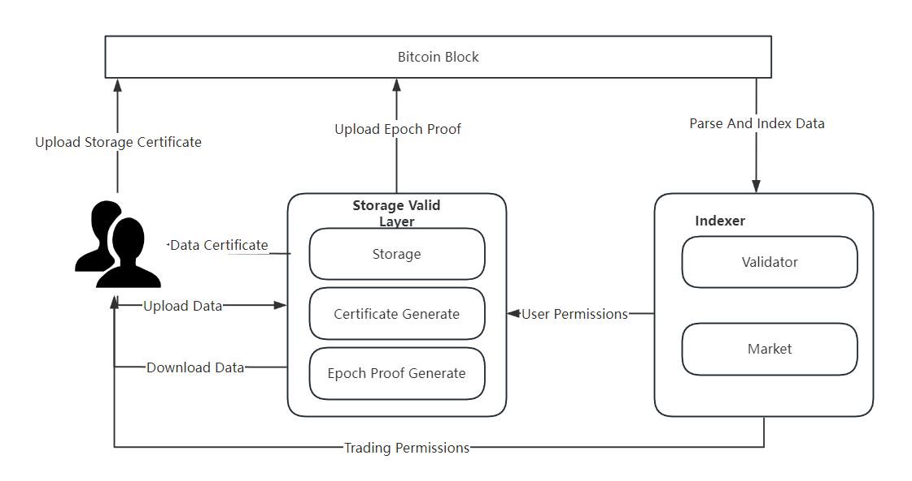

# Mooda Whitepaper

## Introduction

        Blockchain technology, with its secure, decentralized, and transparent characteristics, continues to attract attention in the financial and technology sectors. Bitcoin, as a leader in this field, has recently made significant progress. With the witnessing isolation SegWit and Taproot upgrades, Bitcoin's storage space has been expanded, leading to the emergence of applications such as the Ordinal Protocol and Inscriptions, which facilitate users in storing data within Bitcoin. However, the appearance of these applications has only slightly alleviated the storage demand pressure on the Bitcoin ecosystem. Therefore, the ecosystem has proposed a scaling solution – using an off-chain Data Availability Layer as a solution for Bitcoin scaling.

        Mooda (Memo Bitcoin Ordinals Data Availability) is a continuously verifiable Data Availability Layer based on Bitcoin, aiming to improve Bitcoin's storage efficiency and reduce storage costs without sacrificing security. Mooda utilizes Mefs (Memolabs' decentralized storage system) to provide storage services and uses Bitcoin blocks to store verification information. The entire system's verification and state changes are completed by offline indexers. Mooda's goal is to provide Bitcoin ecosystem users with a low threshold, low cost, high efficiency, and high security Data Availability Layer.

## Inscription System

### Inscription

        Due to the size limitations of Bitcoin, the digital collectible ecosystem on Bitcoin has been lukewarm until Bitcoin underwent the witnessing isolation SegWit and Taproot upgrades. Users can now inscribe up to 4MB of content in each transaction, making the technology and space of Bitcoin sufficient for digital asset applications. Thus, the concept of digital asset inscription based on Bitcoin was born.

        Inscription is a piece of data inscribed (inscribed) on satoshis (the smallest accounting unit of Bitcoin) using the Ordinal Protocol. In the context of the Bitcoin blockchain, the emergence of inscription allows users to inscribe any content up to 4MB onto specified satoshis, which is then persistently stored by Bitcoin blocks. The advent of inscription has brought new functions and application scenarios to the Bitcoin ecosystem, especially in the fields of data storage and non-fungible tokens (NFTs).

        The Ordinal Protocol is a scheme for numbering satoshis, enabling tracking and transfer of individual satoshis. The numbering scheme depends on the order in which satoshis are mined, and the transfer scheme depends on the order of transaction inputs and outputs. The Ordinal Protocol can attach any form of content as a stable identifier to satoshis.

        Since Taproot scripts can only be used from existing Taproot outputs, inscription is realized through two stages: submission and revelation, which are collectively referred to as the inscription process.

### Indexer

        Although inscription technology brings innovative development opportunities to the Bitcoin ecosystem, Bitcoin's scripting language still has limitations: it cannot directly handle complex logic and programs. To overcome this challenge of Turing incompleteness, ecosystem users have introduced the concept of a Bitcoin indexer. As a supplementary solution, the indexer enables Bitcoin to indirectly handle more complex logic, thereby expanding its functionality and enhancing its applicability in modern blockchain applications.

        The indexer retrieves Bitcoin block and transaction data, obtains data inscribed in blocks, and combines offline storage layers to construct a Turing-complete system.

        The indexer includes the following functions:

1. Retrieval of on-chain data (identifying data inscribed on satoshis)

2. Filtering on-chain data, determining status, determining data ownership (who uploaded it), and determining data permissions (who can download it)

### BRC-721

        BRC-721 is a protocol for implementing non-fungible tokens (NFTs) on Bitcoin, achieving token deployment, minting, transfer, and update operations through specifically formatted inscriptions, providing a solution for realizing non-fungible tokens on the Bitcoin blockchain.

        BRC-721 ensures data availability through third-party storage, mainly serving lightweight storage applications such as digital assets, and is not suitable for applications where users need to store large amounts of data. Moreover, even using IPFS as a storage solution can face issues with user data confidentiality, and this solution cannot meet users' needs for storing private data.

## Current Issues

        Storing data directly on the Bitcoin blockchain, while obtaining immutable and persistent characteristics, also has some significant drawbacks and challenges:

1. On-chain storage requires transaction fees. Each read and write operation of data must be added to the blockchain as a transaction, which can become very expensive for large amounts of data. For example, an anonymous wallet spent 1.5 Bitcoins (valued at approximately $66,000 at the time) to inscribe nearly 9MB of data.

2. Blockchain networks typically have strict data limits, with a limited amount of storage per block. Although Bitcoin has undergone the Taproot upgrade, which increased the data that can be written in a single transaction from 80 bytes to about 4MB, it still cannot meet the growing storage demands within the network.

3. As the blockchain network grows, the increase in on-chain data may lead to network congestion, reducing transaction processing speeds. With the popularity of inscriptions, it is not uncommon for a single inscription to fill an entire block on the Bitcoin network, affecting the packaging of other transaction data.

4. The data on the blockchain network is usually public, meaning anyone can view the information stored on the chain. This can lead to privacy leakage risks, especially in scenarios requiring confidential storage.To address the aforementioned issues within Bitcoin, ecosystem participants have proposed the concept of a Data Availability Layer.

## Data Availability Layer

        The Data Availability Layer is an emerging solution designed to address the issues of data storage and accessibility within blockchain networks. It ensures that all network participants can quickly and easily access user data and other information.

        This layer has the following characteristics:

* By offloading data storage tasks from the chain, it helps to reduce the burden on the chain, thereby improving the overall network's processing speed and efficiency.

* It provides a data verification mechanism that ensures the accuracy and integrity of the data without exposing the data itself, enhancing the privacy of storage.

* The layer can include permission controls within the storage layer, safeguarding users' data security and privacy needs.

* Data storage usually employs distributed storage, which helps maintain the decentralized nature of the entire network.

* Strong compatibility allows it to support multiple blockchain networks.

## Solutions

        To address the issue of on-chain data storage, the following sections will discuss current solutions and the Mooda solution separately.

### Current DA Solutions

        Here, we will separately introduce the data availability solutions of the Ethereum ecosystem and the Bitcoin ecosystem.

#### ETH's Solutions

        ETH primarily has two solutions. The first is to optimize the storage overhead of Layer 2, such as Ethereum's Danksharding proposal, which currently uses EIP-4844 to implement blob transactions, reducing the storage overhead of Layer 2 relying on Ethereum as a Data Availability Layer. The second is the modular blockchain solution, which separates the execution layer, consensus layer, and data availability layer for design, such as the Celestia project, aiming to simplify blockchain deployment by providing a pluggable consensus network.

#### BTC's Solutions

        BTC currently has data availability solutions such as Nubit and B2.

        Nubit uses a modular indexer and data availability layer combination solution. The committee indexer calculates checkpoints based on on-chain data, then stores the checkpoints in the data availability layer; ordinary indexers return query results and proofs; lightweight indexers obtain checkpoints from the data availability layer and verify the correctness of the proofs. The Nubit solution simplifies the integrity check of the entire state to the validity check of a small number of checkpoints.

        B2's Data Availability Layer consists of three parts: decentralized storage, the Bitcoin network, and B2 nodes. Decentralized storage retrieves data from the Rollup layer and stores it, generating zero-knowledge proofs based on the time and space of the storage summary, and sends the storage proofs to B2 nodes, which act as off-chain validators, verifying the correctness of the storage proofs; the Bitcoin network serves as the final settlement layer for the B2 network, and the summary data of the B2 network is stored in the Bitcoin network, confirming the transaction data of B2 based on the B2 inscriptions on the Bitcoin network.

#### Existing Solution Issues

* ETH's solution cannot be directly applied to the Bitcoin field at present.

* Nubit's solution requires ensuring that at least one committee indexer is loyal to ensure data availability.

* B2's solution requires running B2 nodes.

### Mooda Solution

        Mooda addresses the challenges of on-chain data storage in Bitcoin by implementing an off-chain Data Availability Layer. This solution stores data in decentralized storage systems off the chain while placing storage vouchers and verification information on the Bitcoin blockchain. Verification nodes can then access this information from the chain to validate the existence of data in storage.

        Mooda is composed of three main components: the storage validation layer, Bitcoin blocks, and indexers. It operates by storing user data off the chain in a decentralized manner, depositing the proofs and verification information on the Bitcoin blockchain, and utilizing indexers to retrieve and verify the information on the chain.

        One of the key features of Mooda is its periodic submission of proofs to the blockchain, ensuring the sustainability of verification. To prevent the reuse of the same proof by the storage proof layer, a random number is selected for each cycle to participate in the generation of the proof.

#### Storage Validation Layer

        The Storage Validation Layer within Mooda includes data storage, voucher generation, and periodic proof generation. After a user uploads data, this layer returns a data storage voucher. Once the voucher is on the chain, the storage validation layer uploads proofs to the chain in each cycle, providing download services to users with permission as provided by the indexer.

* Storage: Mooda utilizes decentralized storage solutions like Mefs to provide reliable and secure storage services for the entire system, offering interfaces for data upload and download, and ensuring that the data is stored.

* Voucher Generation: Based on the data uploaded by users, Mooda generates storage vouchers that serve as proof to the user of the object and duration of the storage, providing evidence that the data has been securely stored.

* Data Periodic Proof: The data periodic proof encompasses two types of information: the cycle and the proof. The cycle defines the scope of validation, while the proof ensures that the data exists within the storage for the duration of that cycle. To guarantee the unpredictability of each cycle's proof, a random number is introduced into the proof generation process.

#### Indexer

        Indexers in Mooda monitor the Bitcoin network for blocks and transactions, extract the verification information stored within, and use this to verify the correctness of user data, ensuring data availability.

        Indexers consist of two parts: validators and a marketplace. 

* Validator: Validators are responsible for validating the data obtained by the indexer, confirming that the user's data is effectively preserved by the storage layer. 

* Marketplace: The marketplace allows users to trade data storage permissions, with those holding read permissions able to access the corresponding data from the storage validation layer.

#### Bitcoin Inscriptions

        Mooda leverages Bitcoin inscriptions to store critical information such as data vouchers, proofs, and cycles, ensuring that this essential and minimal data is persistently stored on Bitcoin and transparently displayed to all validators for verification of data availability.

        Mooda's inscriptions are categorized into three types:

1. Data Unique Voucher Inscription: This is a unique voucher generated by the storage validation layer based on the data content, serving as proof to the user that the data has been stored. The inscription includes the storage signature and the data's hash value.

2. Cycle Inscription: This inscription contains temporal information and acts as a measure for the entire continuous verification system, allowing validators to confirm the scope of validation and providing a changing random number over time to prevent predictability in the generation of storage proofs.

3. Data Proof Inscription: This inscription contains the proof generated by the storage validation layer based on the data and the random number provided by the cycle inscription. It is periodically submitted to the Bitcoin network by the storage validation layer.

        Mooda uses the inscription ID of the cycle inscription as a random seed for verification, introducing an element of unpredictability to prevent predictive attacks.

## Technical Highlights

        Mooda introduces the concept of cycle inscriptions, which not only establishes a cycle for uploading availability proofs but also addresses the issue of obtaining random seeds in zero-knowledge proofs.

        By storing voucher and proof information on the Bitcoin network for persistent storage, while keeping user data in off-chain decentralized storage systems, Mooda achieves a low-cost, highly scalable, and decentralized Data Availability Layer.

        Relying on existing Bitcoin inscriptions, Mooda lowers the barrier for user adoption, allowing for convenient and efficient solutions to data availability issues within the Bitcoin ecosystem.
